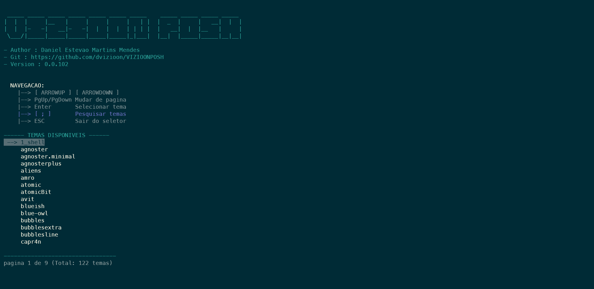
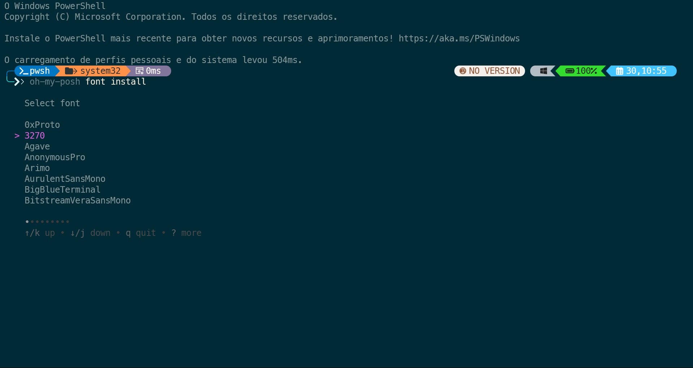
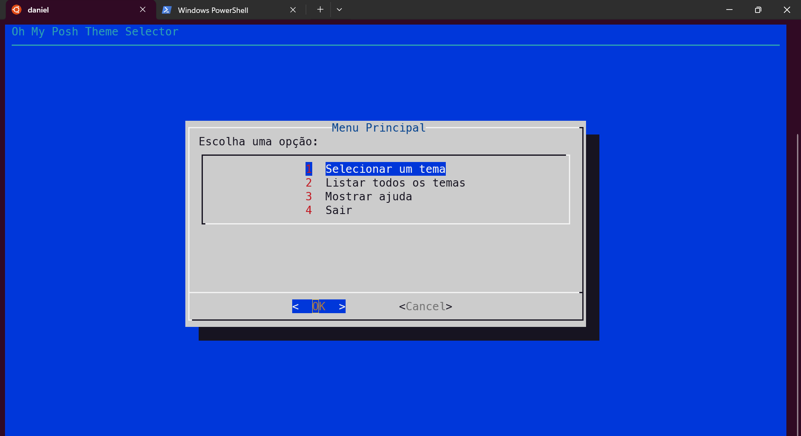
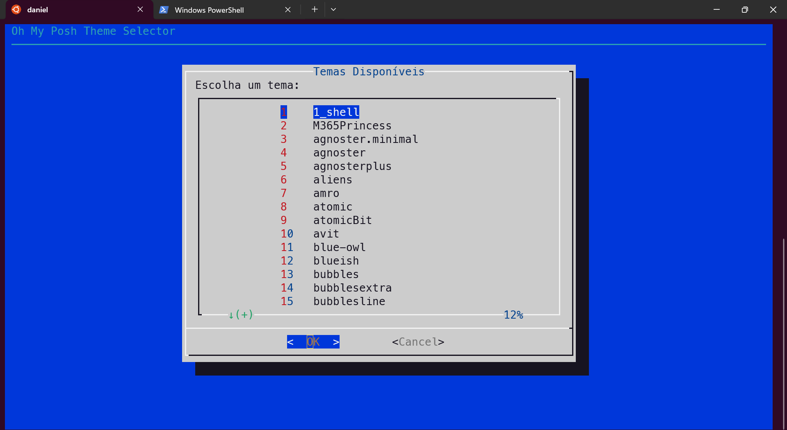
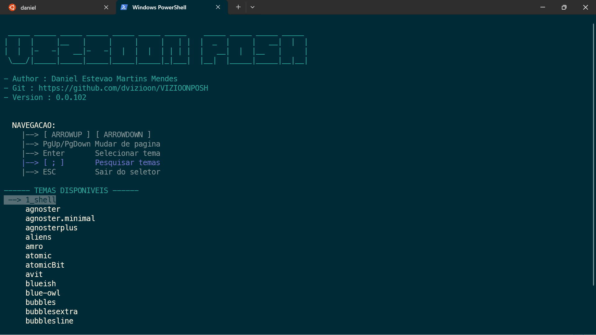
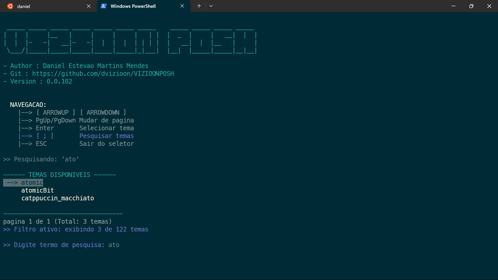
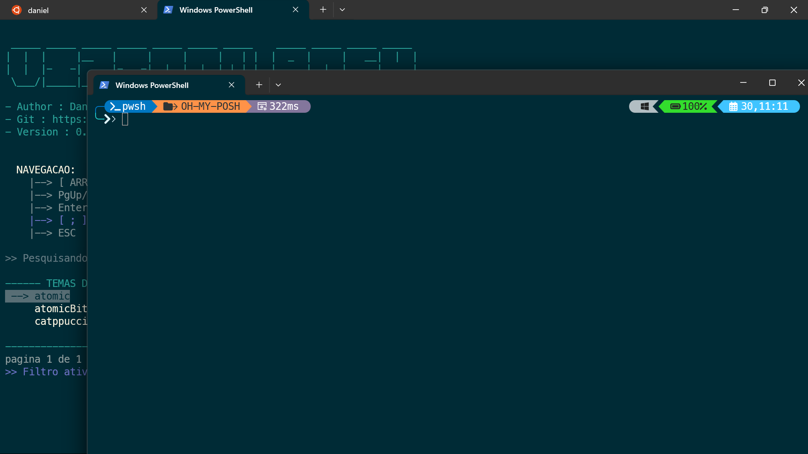
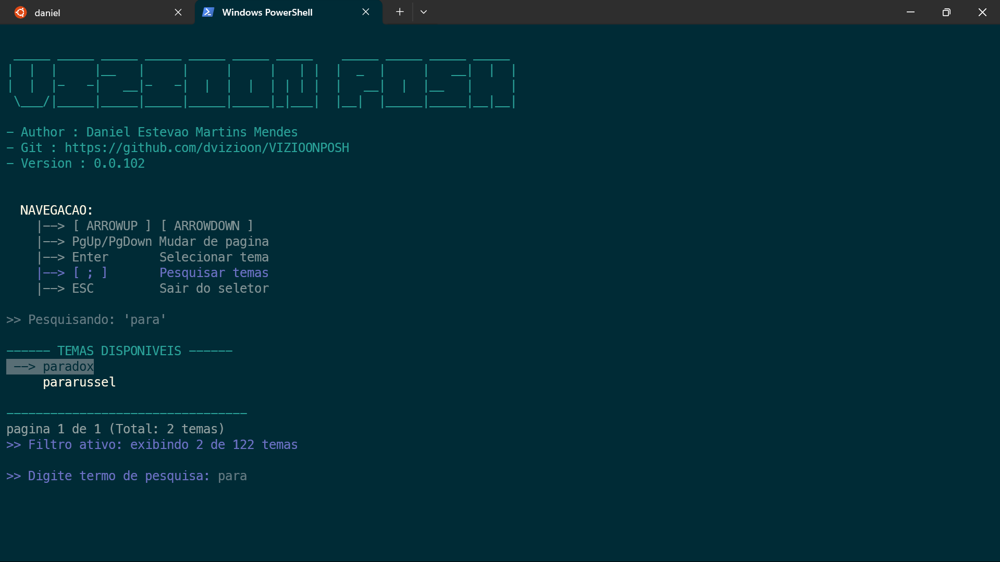
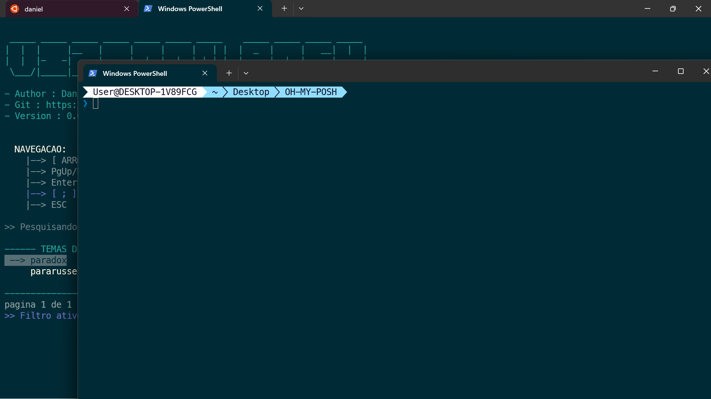
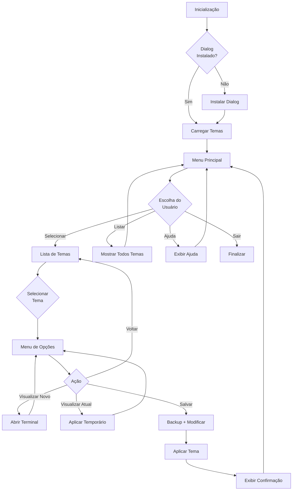

# Seletor de Temas Oh My Posh

[](https://ohmyposh.dev/)
[](https://github.com/PowerShell/PowerShell)
[](https://www.gnu.org/software/bash/)
[](https://www.microsoft.com/windows)
[](https://www.linux.org/)
[](https://github.com/dvizioon/VIZIOONPOSH/releases)

<div align="center">
  
  <h3>Personalize seu terminal com estilo e facilidade!</h3>
</div>


## 📌 Apresentação da Ferramenta
<div align="center">
  
  <h3>Ihuuuu 🎯</h3>
</div>

## 📌 Visão Geral

**Seletor de Temas Oh My Posh** é uma ferramenta interativa de linha de comando que transforma a experiência de personalização do [Oh My Posh](https://ohmyposh.dev/). Desenvolvida para simplificar a navegação, visualização e aplicação de temas em ambientes Windows (PowerShell) e Linux (Bash), esta ferramenta elimina a necessidade de editar manualmente arquivos de configuração.

A versão Linux (oh-my-linux) utiliza o utilitário **Dialog** para criar uma interface mais amigável e robusta, enquanto a versão Windows (oh-my-gui) utiliza uma interface TUI nativa do PowerShell.

**Autor:** Daniel Estevão Martins Mendes  
**Repositório:** [github.com/dvizioon/VIZIOONPOSH](https://github.com/dvizioon/VIZIOONPOSH)  


## ✨ Funcionalidades

- 🎨 **Interface Amigável**: Interface de texto rica e colorida com navegação intuitiva (TUI no PowerShell, Dialog no Linux)
- 🔍 **Sistema de Busca Avançado**: Filtragem instantânea de temas enquanto você digita
- 👁️ **Pré-visualização em Tempo Real**: Abra uma nova janela de terminal para testar o tema antes de aplicá-lo
- 💾 **Modificação Automática de Perfil**: Atualiza automaticamente seus arquivos `.bashrc` ou `$PROFILE` do PowerShell
- 🌈 **Multiplataforma com Paridade de Recursos**: Mesmas funcionalidades no Windows e Linux
- 📋 **API de Linha de Comando**: Suporte a comandos diretos para integração com scripts

## 📋 Pré-requisitos

- [Oh My Posh](https://ohmyposh.dev/) instalado e funcionando
- PowerShell 5.1+ (Windows) ou Bash 4.0+ (Linux)
- Dialog (versão Linux - instalado automaticamente pelo script)
- Terminal com suporte a UTF-8 e cores ANSI
- Permissões de escrita para os arquivos de perfil do shell

## 💻 Instalação Detalhada

### Windows

1. Clone o repositório ou baixe os arquivos:
   ```powershell
   git clone https://github.com/dvizioon/VIZIOONPOSH.git
   cd VIZIOONPOSH
   ```

2. Certifique-se de que os scripts tenham as permissões corretas:
   ```powershell
   Unblock-File .\oh-my-gui.ps1
   ```

3. Para instalação permanente, copie os arquivos para um diretório em seu PATH:
> Entre na pasta ./VIZIOONPOSH abra o terminal dentro.
   ```powershell
   # Exemplo: Criar diretório em AppData e adicionar ao PATH
   $installDir = "$env:APPDATA\VIZIOONPOSH"
   if (-not (Test-Path $installDir)) { New-Item -ItemType Directory -Path $installDir }
   Copy-Item .\oh-my-gui.ps1, .\oh-my-gui.ps1 $installDir
   
   # Adicionar ao PATH (requer reiniciar o terminal após)
   $userPath = [Environment]::GetEnvironmentVariable("Path", "User")
   if ($userPath -notlike "*$installDir*") {
       [Environment]::SetEnvironmentVariable("Path", "$userPath;$installDir", "User")
   }
   ```

### Linux

1. Clone o repositório ou baixe o script:
   ```bash
   git clone https://github.com/dvizioon/VIZIOONPOSH.git
   cd VIZIOONPOSH
   ```

2. Torne o script executável:
   ```bash
   chmod +x oh-my-linux.sh
   ```

3. Para instalação global, mova para um diretório no PATH:
   ```bash
   # Opção 1: Instalação para usuário atual
   mkdir -p ~/.local/bin
   cp oh-my-linux.sh ~/.local/bin/oh-my-linux
   
   # Se ~/.local/bin não estiver no PATH, adicione-o
   echo 'export PATH="$HOME/.local/bin:$PATH"' >> ~/.bashrc
   source ~/.bashrc
   
   # Opção 2: Instalação para todos os usuários
   sudo cp oh-my-linux.sh /usr/local/bin/oh-my-linux
   ```

> [!NOTE]
> A versão Linux do seletor de temas (oh-my-linux.sh) tenta instalar automaticamente o utilitário Dialog se não estiver presente. Em caso de falha na instalação automática, você pode instalar manualmente usando: `sudo apt-get install dialog` (no Ubuntu/Debian) ou o comando apropriado para sua distribuição.

## 🔧 Arquitetura Técnica

### Diferenças entre as Versões Windows e Linux

#### Versão Windows (oh-my-gui)
- Utiliza interface TUI (Text User Interface) nativa do PowerShell
- Manipulação direta do console para desenhar menus e capturar teclas
- Gerenciamento direto de arquivos usando cmdlets PowerShell

#### Versão Linux (oh-my-linux)
- Utiliza o utilitário **Dialog** para criar interfaces de usuário amigáveis
- Interface consistente entre diferentes terminais e distribuições Linux
- Menus, caixas de diálogo e formulários gerenciados pela biblioteca Dialog
- Detecção automática e instalação de dependências (Dialog)
- Solução robusta para problemas de captura de teclas comuns no WSL

### Fluxo de Trabalho Interno

1. **Inicialização e Detecção de Ambiente**:
   - Verificação da instalação do Oh My Posh
   - Verificação da instalação do Dialog (versão Linux)
   - Detecção automática dos diretórios de temas em múltiplos caminhos possíveis
   - Configuração de variáveis de ambiente e preparação da interface

2. **Carregamento de Temas**:
   - Leitura recursiva dos arquivos `.omp.json` do diretório de temas
   - Indexação e ordenação alfabética para acesso rápido
   - Carregamento em memória para navegação eficiente

3. **Interface Interativa**:
   - **Windows**: Implementação de controle de cursor e manipulação direta do console
   - **Linux**: Interfaces Dialog com menus, botões e caixas de diálogo
   - Manipulação de eventos de teclado e seleções de menu
   - Gerenciamento de paginação e visualização para grandes conjuntos de temas

4. **Aplicação de Temas**:
   - Verificação de permissões de arquivo
   - Criação de backup dos arquivos de perfil antes de modificá-los
   - Escrita de configuração consistente usando expressões regulares para substituição
   - Correções automáticas para problemas específicos (como parênteses em variáveis no WSL)

5. **Visualização de Temas**:
   - Detecção do terminal padrão do sistema
   - Lançamento de processo filho com configuração temporária
   - Isolamento do ambiente para evitar conflitos

### Armazenamento e Persistência

#### Windows (PowerShell)

O script gerencia a configuração do Oh My Posh no arquivo de perfil do PowerShell:

```powershell
# Localização do perfil que será modificado
$profilePath = $PROFILE.CurrentUserCurrentHost  # Geralmente ~\Documents\PowerShell\Microsoft.PowerShell_profile.ps1

# Exemplo de modificação que o script faz
# Ele primeiro remove qualquer inicialização existente do Oh My Posh
$cleanedContent = $profileContent -replace '(?m)^oh-my-posh init pwsh.*$', ''

# Em seguida, adiciona a nova configuração
$newContent = $cleanedContent + "`n`noh-my-posh init pwsh --config `"$themeConfig`" | Invoke-Expression`n"

# Atualiza o arquivo de perfil
Set-Content -Path $profilePath -Value $newContent.Trim()
```

#### Linux (Bash)

No Linux, o gerenciamento ocorre no arquivo `.bashrc` com correções específicas para o WSL:

```bash
# Localização do arquivo de perfil
bashrc="$HOME/.bashrc"

# Backup automático antes da modificação
cp "$bashrc" "$bashrc.bak.$(date +%Y%m%d%H%M%S)"

# Remove configurações anteriores do Oh My Posh
sed -i '/eval "$(oh-my-posh init bash/d' "$bashrc"

# Adiciona a nova configuração para o tema selecionado com correção para o WSL
echo "eval \"\$(oh-my-posh init bash --config '$theme_config' | sed 's/export POSH_SHELL_VERSION=\\([^)]*\\))/export POSH_SHELL_VERSION=\"\\1\"/g')\"" >> "$bashrc"
```

## 🚀 Exemplos de Uso

### Exemplos Básicos

**Iniciar o selector interativo:**

```bash
# No Linux (interface Dialog)
oh-my-linux

# No Windows (PowerShell)
oh-my-gui
```

**Listar todos os temas disponíveis:**

```bash
# Linux
oh-my-linux --list

# Windows
oh-my-gui --list
```

**Aplicar um tema específico diretamente:**

```bash
# Linux - Aplicar o tema 'atomic'
oh-my-linux --theme=atomic

# Windows - Aplicar o tema 'paradox'
oh-my-gui --theme=paradox
```

### Exemplos Avançados

**Integração com scripts de inicialização:**

```bash
# No Linux - Adicionar ao .bash_aliases para ter um comando abreviado
echo 'alias ompgui="oh-my-linux"' >> ~/.bash_aliases
source ~/.bash_aliases

# No Windows - Criar um alias no PowerShell
Add-Content $PROFILE "`nfunction Set-PoshTheme { oh-my-gui }"
. $PROFILE
```

**Automatização e uso programático:**

```bash
# Aplicar tema diferente baseado no hostname (Linux)
if [[ "$(hostname)" == *"prod"* ]]; then
  oh-my-linux --theme=powerlevel10k_rainbow
else
  oh-my-linux --theme=powerlevel10k_lean
fi

# Aplicar tema diferente baseado no dia da semana (Windows)
$day = (Get-Date).DayOfWeek
switch ($day) {
  "Monday"    { oh-my-gui --theme=atomic }
  "Friday"    { oh-my-gui --theme=star }
  default     { oh-my-gui --theme=paradox }
}
```

## 🎮 Guia de Navegação e Uso Completo

### Interface Linux (Dialog) - Guia Detalhado

A versão Linux usa o Dialog para uma navegação simplificada:

1. **Iniciando o programa**:
   ```bash
   ./oh-my-linux.sh
   ```

2. **No Menu Principal**:
   - Use **↑** / **↓** para navegar entre as opções
   - Pressione **Enter** para selecionar a opção destacada
   - Pressione **Tab** para alternar entre os controles
   - Pressione **ESC** para sair do programa

3. **Na Lista de Temas**:
   - Use **↑** / **↓** para navegar entre os temas
   - Pressione **PgUp** / **PgDn** para navegar entre páginas
   - Pressione **Enter** para selecionar o tema destacado
   - Pressione **ESC** para voltar ao menu principal

4. **No Menu de Opções do Tema**:
   - Selecione **Visualizar (abre novo terminal)** para ver o tema em uma nova janela
   - Selecione **Visualizar no terminal atual** para aplicar temporariamente
   - Selecione **Salvar e aplicar permanentemente** para configurar o tema como padrão
   - Selecione **Voltar para a lista de temas** ou pressione **ESC** para retornar

5. **Ao Aplicar Permanentemente**:
   - O script cria um backup do seu `.bashrc`
   - Adiciona a configuração do tema selecionado
   - Aplica imediatamente o tema na sessão atual
   - Exibe uma mensagem de confirmação
   - Retorna ao menu principal

6. **Usando Parâmetros de Linha de Comando** ( ps1 || sh || bat ):

| Parâmetro | Descrição | Exemplo |
|-----------|-----------|---------|
| `--list` | Lista todos os temas disponíveis | `./oh-my-gui.ps1 --list` |
| `--theme=<nome>` | Aplica diretamente o tema especificado | `./oh-my-gui.ps1 --theme=atomic` |
| `--help` | Exibe a ajuda e instruções | `./oh-my-gui.ps1 --help` |

Essa formatação em tabela torna a informação mais organizada e fácil de consultar, destacando claramente cada parâmetro, sua descrição e um exemplo de uso.

> [!TIP]
> Para melhor experiência no WSL, instale uma fonte Nerd Font usando `oh-my-posh font install` e configure o Windows Terminal para usar essa fonte ou Linux.

> [!SUCCESS] 
> Fonts Recomendadas ( 3270 e Meslo )

<div align="center">
  <p><strong>Fonts</strong></p>
  
  
</div>

### Controles da Interface Windows (TUI)

| Tecla | Função |
|-------|--------|
| `↑` / `↓` | Navegação vertical item a item |
| `PgUp` / `PgDn` | Navegação por página (15 itens) |
| `Home` / `End` | Ir para o primeiro/último tema |
| `Enter` | Selecionar tema atual |
| `;` | Ativar modo de pesquisa |
| `ESC` | Voltar ao menu anterior ou sair |

### Menu de Tema Selecionado

Nas duas versões, após selecionar um tema você terá as opções:

| Opção | Função | Comportamento |
|-------|--------|--------------|
| Visualizar | Abre um novo terminal com o tema carregado temporariamente | Permite testar o tema sem modificar configurações permanentes |
| Visualizar no terminal atual | Aplicar temporariamente no terminal atual (apenas versão Dialog) | Aplica o tema na sessão atual sem modificar arquivos |
| Salvar | Salva o tema no perfil e o aplica permanentemente | Modifica `.bashrc` (Linux) ou `$PROFILE` (Windows), fazendo backup primeiro |
| Cancelar/Voltar | Retorna ao menu de temas sem aplicar alterações | Nenhuma modificação é feita |

### Exemplo de Sessão Completa (Linux)

1. Execute `./oh-my-linux.sh`
2. No menu principal, selecione **Selecionar um tema**
3. Navegue pela lista e selecione um tema (ex: "atomic")
4. Selecione **Visualizar no terminal atual** para testar o tema
5. Após visualizar, selecione **Salvar e aplicar permanentemente**
6. O script salva o tema e o aplica
7. Agora seu terminal usará este tema por padrão

## 📸 Capturas de Tela e Fluxo Visual

### Interface Dialog (Linux)
<div align="center">
  <p><strong>Menu Principal do Dialog</strong></p>
  
  
  <p><strong>Seleção de Tema com Dialog</strong></p>
  
</div>

### Versão PowerShell (Windows)
<div align="center">
  
</div>

### Exemplos de Temas Aplicados
<div align="center">
  <p><strong>Tema Atomic</strong></p>
  
  
  
  <p><strong>Tema Paradox</strong></p>
  
   
</div>

## 🔍 Detalhes de Implementação e Fluxo de Trabalho Completo

### Fluxo de Operação Detalhado da Versão Dialog (Linux)

A versão Linux do seletor utiliza uma abordagem baseada em Dialog que segue este fluxo de trabalho:

1. **Inicialização**:
   - Verificação de dependências (Oh My Posh e Dialog)
   - Instalação automática do Dialog se necessário
   - Detecção do diretório de temas
   - Escaneamento e indexação dos temas disponíveis

2. **Menu Principal** (`main_menu`):
   - Apresenta o banner artístico do Oh My Posh
   - Oferece 4 opções primárias:
     - Selecionar um tema (abre a lista de temas)
     - Listar todos os temas (visualização simples)
     - Mostrar ajuda (documentação de uso)
     - Sair (encerra o programa)

3. **Seleção de Tema** (`select_theme_dialog`):
   - Exibe todos os temas em uma lista interativa paginada
   - Permite navegação vertical com teclas de seta
   - Cada tema é listado com um número de índice e nome
   - Pressionar Enter seleciona o tema atual

4. **Menu de Opções para o Tema** (após seleção):
   - Visualizar em novo terminal (abre uma instância isolada)
   - Visualizar no terminal atual (aplicação temporária)
   - Salvar e aplicar permanentemente (modifica `.bashrc`)
   - Voltar para a lista de temas

5. **Visualização de Tema**:
   - **Em Novo Terminal** (`preview_theme_in_new_terminal`): 
     - Tenta abrir o terminal apropriado para o ambiente
     - Aplica o tema em um ambiente isolado
     - Não modifica nenhum arquivo de configuração
   - **No Terminal Atual** (`apply_theme_temporarily`):
     - Aplica o tema na sessão atual com `eval`
     - Mostra os efeitos imediatamente
     - Revert ao término da visualização

6. **Salvamento de Tema** (`save_theme_to_profile`):
   - Cria backup do arquivo `.bashrc`
   - Remove configurações existentes do Oh My Posh
   - Adiciona a nova configuração com o tema selecionado
   - Aplica no ambiente atual para efeito imediato
   - Inclui correções para problemas de sintaxe no WSL
   - Exibe mensagem de confirmação

7. **Retorno ao Menu**: Após cada operação, o script retorna ao ponto apropriado no fluxo de navegação:
   - Após visualizar: volta ao menu de opções do tema
   - Após salvar: volta ao menu principal
   - Após cancelar: volta ao menu anterior

8. **Finalização**: 
   - Limpa recursos temporários
   - Restaura configurações originais do terminal
   - Exibe mensagem de despedida



### Sistema de Dialog no Linux

> [!IMPORTANT]
> A versão Linux utiliza o Dialog para criar interfaces de usuário mais robustas e compatíveis, especialmente no ambiente WSL. O Dialog oferece vários tipos de widgets que são usados no script.

O script verifica e instala automaticamente o Dialog se necessário:

```bash
# Verificar e instalar Dialog se necessário
if ! command -v dialog &> /dev/null; then
    echo -e "${YELLOW}O utilitário Dialog não está instalado. Tentando instalar...${RESET}"
    if command -v apt-get &> /dev/null; then
        sudo apt-get update -qq && sudo apt-get install -y dialog
    elif command -v yum &> /dev/null; then
        sudo yum install -y dialog
    elif command -v dnf &> /dev/null; then
        sudo dnf install -y dialog
    elif command -v pacman &> /dev/null; then
        sudo pacman -S --noconfirm dialog
    else
        echo -e "${RED}Não foi possível instalar o Dialog automaticamente.${RESET}"
        echo "Por favor, instale o Dialog manualmente com o gerenciador de pacotes do seu sistema."
        exit 1
    fi
}
```

O script utiliza vários tipos de widgets do Dialog para diferentes fins:

```bash
# Menu principal
local option=$(dialog --backtitle "Oh My Posh Theme Selector" --title "Menu Principal" \
                    --menu "Escolha uma opção:" 15 60 4 \
                    "1" "Selecionar um tema" \
                    "2" "Listar todos os temas" \
                    "3" "Mostrar ajuda" \
                    "4" "Sair" \
                    2>&1 >/dev/tty)

# Caixa de mensagem
dialog --title "Tema Aplicado" --msgbox "Tema '$theme_name' salvo e aplicado com sucesso!\n\nO tema será carregado automaticamente em novas sessões." 10 50

# Caixa de confirmação
if dialog --title "Temas Similares" --yesno "Deseja selecionar um destes temas?" 15 60; then
    # Código executado se o usuário selecionar "Sim"
fi

# Lista de seleção para temas
local cmd=(dialog --backtitle "Oh My Posh Theme Selector" --title "Temas Disponíveis" --menu "Escolha um tema:" 22 60 15)
local choice=$("${cmd[@]}" "${theme_options[@]}" 2>&1 >/dev/tty)
```

### Sistema de Arquivos Temporários

> [!NOTE]
> No código real, a criação do arquivo temporário é simplificada e usa injeção direta de comando. Esta versão demonstra o conceito de forma mais explícita.

### Sistema de Detecção de Diretórios (Linux)

> [!TIP]
> O mecanismo de fallback garante compatibilidade com diversas distribuições Linux e métodos de instalação do Oh My Posh.

O script utiliza um mecanismo de fallback para localizar os temas do Oh My Posh:

```bash
# Configurar caminhos
POSH_THEMES_PATH="$HOME/.cache/oh-my-posh/themes"
if [ ! -d "$POSH_THEMES_PATH" ]; then
    POSH_THEMES_PATH="$HOME/.poshthemes"
    if [ ! -d "$POSH_THEMES_PATH" ]; then
        POSH_THEMES_PATH="/usr/local/share/oh-my-posh/themes"
        if [ ! -d "$POSH_THEMES_PATH" ]; then
            # Tente encontrar temas em caminhos comuns
            for path in "/usr/share/oh-my-posh/themes" "$HOME/.local/share/oh-my-posh/themes"; do
                if [ -d "$path" ]; then
                    POSH_THEMES_PATH="$path"
                    break
                fi
            done
        fi
    fi
fi
```

## ⚠️ Solução Avançada de Problemas

> [!WARNING]
> Antes de realizar qualquer modificação manual nos arquivos de configuração, faça backup dos seus arquivos de perfil (.bashrc, Microsoft.PowerShell_profile.ps1)!

### Problemas Específicos do WSL

Se você estiver usando o WSL (Windows Subsystem for Linux), pode encontrar alguns problemas específicos:

1. **Erro `WSL_E_DISTRO_NOT_FOUND`**: Este erro ocorre ao tentar usar o Windows Terminal para visualizar temas. A versão Linux corrigida usa apenas emuladores de terminal compatíveis com o WSL.

2. **Erro `bad array subscript` ou problemas com parênteses**: Pode ocorrer um erro relacionado à variável POSH_SHELL_VERSION. O script corrige esse problema automaticamente usando `sed`:

   ```bash
   # Correção para problema de parênteses no valor da variável POSH_SHELL_VERSION
   eval "$(oh-my-posh init bash --config "$theme_config" | sed 's/export POSH_SHELL_VERSION=\([^)]*\))/export POSH_SHELL_VERSION="\1"/g')"
   ```

3. **Problemas com fontes**: Se você vir símbolos estranhos ou quadrados, instale uma fonte Nerd Font usando `oh-my-posh font install` e configure seu terminal para usar essa fonte.

4. **Problemas de permissão no WSL**: Se o script não conseguir modificar o `.bashrc`, verifique as permissões do arquivo:
   ```bash
   ls -la ~/.bashrc
   chmod u+w ~/.bashrc  # Se necessário
   ```

5. **Problemas com Dialog no WSL**: Se o Dialog apresentar comportamento estranho no WSL, tente exportar a variável `TERM`:
   ```bash
   export TERM=xterm-256color
   ./oh-my-linux.sh
   ```

### Guia Completo de Resolução de Problemas

#### Tema não encontrado ou não aplicado

**Diagnóstico**:
```bash
# Verifique a instalação do Oh My Posh
which oh-my-posh
oh-my-posh --version

# Verifique os diretórios de temas
ls -la ~/.cache/oh-my-posh/themes/
ls -la /usr/local/share/oh-my-posh/themes/
ls -la ~/.poshthemes/

# Verifique permissões de arquivos
ls -la ~/.bashrc
```

**Soluções**:
1. Reinstale o Oh My Posh: `curl -s https://ohmyposh.dev/install.sh | bash -s`
2. Baixe os temas manualmente: `mkdir -p ~/.poshthemes && oh-my-posh theme get-all`
3. Defina manualmente o diretório de temas: `export POSH_THEMES_PATH=~/.poshthemes`

#### Erros no Dialog

**Diagnóstico**:
```bash
# Verifique a instalação do Dialog
which dialog
dialog --version

# Tente reinstalar o Dialog
sudo apt-get update && sudo apt-get install --reinstall dialog
```

**Soluções**:
1. Use os parâmetros de linha de comando para evitar a interface Dialog: `./oh-my-linux.sh --theme=atomic`
2. Exporte a variável TERM: `export TERM=xterm-256color`
3. Verifique se a saída de erro está sendo redirecionada corretamente: `2>&1 >/dev/tty`

#### Problemas na Visualização de Temas

Se a visualização em um novo terminal não funcionar:

1. Verifique quais emuladores de terminal estão disponíveis:
   ```bash
   which gnome-terminal konsole xterm xfce4-terminal
   ```

2. Tente usar o modo de visualização no terminal atual:
   ```bash
   # Aplicar tema temporariamente
   eval "$(oh-my-posh init bash --config ~/.poshthemes/atomic.omp.json)"
   
   # Restaurar (executar um novo bash)
   bash
   ```

> [!TIP]
> Se os temas não forem encontrados, você pode baixá-los manualmente do [repositório oficial](https://github.com/JanDeDobbeleer/oh-my-posh/tree/main/themes) e colocá-los em `~/.poshthemes/`.

### Script de Diagnóstico Completo

Salve este script como `diagnose-oh-my-posh.sh` e execute para verificar sua instalação:

```bash
#!/bin/bash
echo "===== Oh My Posh Diagnostic Tool ====="
echo

# Verificar Oh My Posh
echo "Verificando instalação do Oh My Posh..."
if command -v oh-my-posh &>/dev/null; then
    version=$(oh-my-posh --version)
    echo "✅ Oh My Posh instalado: $version"
else
    echo "❌ Oh My Posh não encontrado!"
    echo "Instale com: curl -s https://ohmyposh.dev/install.sh | bash -s"
    exit 1
fi

# Verificar Dialog
echo
echo "Verificando instalação do Dialog..."
if command -v dialog &>/dev/null; then
    dialog_version=$(dialog --version | head -1)
    echo "✅ Dialog instalado: $dialog_version"
else
    echo "❌ Dialog não encontrado"
    echo "Tente instalar com: sudo apt-get install dialog"
fi

# Verificar diretórios de temas
echo
echo "Verificando diretórios de temas..."
potential_paths=(
    "$HOME/.cache/oh-my-posh/themes"
    "$HOME/.poshthemes"
    "/usr/local/share/oh-my-posh/themes"
    "/usr/share/oh-my-posh/themes"
    "$HOME/.local/share/oh-my-posh/themes"
)

themes_found=false
for path in "${potential_paths[@]}"; do
    if [ -d "$path" ]; then
        theme_count=$(find "$path" -name "*.omp.json" | wc -l)
        echo "✅ Diretório de temas encontrado: $path ($theme_count temas)"
        themes_found=true
    fi
done

if [ "$themes_found" = false ]; then
    echo "❌ Nenhum diretório de temas encontrado!"
    echo "Crie um diretório e baixe os temas:"
    echo "mkdir -p ~/.poshthemes && oh-my-posh theme get-all"
fi

# Verificar terminais disponíveis
echo
echo "Verificando terminais disponíveis..."
terminals=("gnome-terminal" "konsole" "xterm" "xfce4-terminal")
terminal_found=false

for term in "${terminals[@]}"; do
    if command -v "$term" &>/dev/null; then
        echo "✅ Terminal encontrado: $term"
        terminal_found=true
    fi
done

if [ "$terminal_found" = false ]; then
    echo "❌ Nenhum terminal compatível encontrado!"
fi

# Verificar ambiente WSL
echo
echo "Verificando ambiente WSL..."
if grep -q Microsoft /proc/version; then
    echo "✅ Executando no WSL"
    
    # Verificar Windows Terminal
    if command -v wt.exe &>/dev/null; then
        echo "✅ Windows Terminal encontrado"
    else
        echo "❌ Windows Terminal não encontrado no PATH"
    fi
    
    # Distribuição WSL
    distro=$(grep -oP '(?<=^ID=).+' /etc/os-release | tr -d '"')
    echo "✅ Distribuição WSL: $distro"
else
    echo "❌ Não está executando no WSL"
fi

echo
echo "Diagnóstico concluído!"
```

## 🤝 Contribuindo

> [!IMPORTANT]
> Antes de contribuir, verifique se há issues abertas relacionadas à sua ideia ou problema, ou crie uma nova issue para discutir sua proposta!

Este projeto está aberto a contribuições! Algumas maneiras de contribuir:

1. **Melhorias de código**:
   - Otimizações de desempenho
   - Melhoria na detecção de terminais no Linux
   - Implementação para mais shells (Zsh, Fish)

2. **Novos recursos**:
   - Mais opções de interface (curses/ncurses como alternativa ao Dialog)
   - Editor de temas integrado
   - Opções de configuração persistentes

3. **Documentação e testes**:
   - Tradução para outros idiomas
   - Melhorias na documentação técnica
   - Suíte de testes automatizados

> [!TIP]
> Contribuições que incluem testes e documentação têm maior probabilidade de serem aceitas rapidamente!

**Para contribuir**:
1. Fork do repositório
2. Crie um branch para sua feature (`git checkout -b feature/nova-funcionalidade`)
3. Commit suas mudanças (`git commit -m 'Adiciona funcionalidade X'`)
4. Push para o branch (`git push origin feature/nova-funcionalidade`)
5. Abra um Pull Request

## 📜 Licença

[](https://choosealicense.com/licenses/mit/)

Este projeto está licenciado sob a Licença MIT - veja o arquivo LICENSE no repositório para detalhes.

## 🔮 Roadmap

- [ ] **v0.1.0**: Suporte para Zsh e Fish shell
- [ ] **v0.1.5**: Melhorias na interface Dialog
- [ ] **v0.2.0**: Editor básico de temas
- [ ] **v0.3.0**: Configurações persistentes via JSON
- [ ] **v1.0.0**: Estabilidade e compatibilidade completa

---

<div align="center">
  <p><i>O Seletor de Temas Oh My Posh não é afiliado ao Oh My Posh. Oh My Posh é criado e mantido por <a href="https://github.com/JanDeDobbeleer">Jan De Dobbeleer</a>.</i></p>
  
 

</div>
